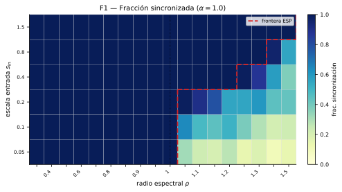

# Reservoir Computing Lab

Laboratorio experimental en Python para estudiar **Echo State Networks (ESN)** y
otras arquitecturas de *reservoir computing*. El proyecto forma parte de un TFG
de Matemáticas y busca relacionar el rendimiento predictivo con las propiedades
dinámicas y topológicas del reservoir, no solo encontrar la configuración con
menor error.

El laboratorio compara reservoirs aleatorios y deterministas, analiza la
frontera de la *Echo State Property* (ESP) y contrasta las configuraciones
seleccionadas con RNN, LSTM y modelos autorregresivos con retardos explícitos.

## Qué incluye

- Tareas NARMA-10, Mackey–Glass, capacidad de memoria y *delay recall*.
- Reservoirs `random_sparse`, `cycle`, `cycle_jump`, `nonnormal_chain` y
  `multiscale`.
- Barridos reproducibles de hiperparámetros y selección multi-tarea.
- Comparaciones controladas entre familias con diagnósticos espectrales,
  no-normalidad y crecimiento transitorio.
- Comparación externa con Simple RNN, LSTM y `TappedDelayRidge`.
- Generación de tablas y figuras a partir de resultados persistidos.



## Requisitos e instalación

- [Python](https://www.python.org/) 3.14 o posterior.
- [uv](https://docs.astral.sh/uv/) para gestionar el entorno y las
  dependencias.

```bash
git clone https://github.com/lsfg01/reservoir-computing-lab.git
cd reservoir-computing-lab
uv sync
```

El entorno fijado en `uv.lock` usa la distribución de PyTorch para CUDA 12.8.
Los experimentos también pueden ejecutarse en CPU; el dispositivo se configura
en los YAML que lo admiten.

## Flujo experimental

Los experimentos se definen mediante YAML. Se recomienda validar primero cada
configuración con `--dry-run`, que expande el espacio de búsqueda sin entrenar:

```bash
# 1. Frontera de la Echo State Property
uv run python scripts/run_esp_frontier.py \
  --config configs/final_campaign/frontier/esp_frontier_v1.yaml \
  --dry-run

# 2. Selección multi-tarea de la región de hiperparámetros
uv run python scripts/run_multitask_sweep.py \
  --config configs/final_campaign/sweep/region_selection_multitask.yaml \
  --dry-run

# 3. Comparación de diseños de reservoir
uv run python scripts/run_design_comparison.py \
  --config configs/final_campaign/design/design_regions.yaml \
  --dry-run

# 4. Comparación externa frente a RNN, LSTM y TappedDelayRidge
uv run python scripts/run_external_comparison.py \
  --config configs/final_campaign/external/external_final_esn_vs_rnn_lstm.yaml \
  --dry-run
```

Para lanzar una fase completa, se elimina `--dry-run`. Las configuraciones de
`configs/final_campaign/` reproducen la campaña final y pueden requerir bastante
tiempo de cómputo. En `configs/prelim_study/` se conservan configuraciones de los
estudios preliminares.

## Resultados y figuras

Los resúmenes principales de la campaña final se encuentran en
`results/final_campaign/`. Los archivos intermedios de cada corrida se omiten
del repositorio para evitar versionar artefactos regenerables.

Las tablas y figuras de la campaña se pueden reconstruir sin repetir los
entrenamientos:

```bash
uv run python scripts/build_campaign_artifacts.py \
  --sweep-dir results/final_campaign/sweep \
  --design-dir results/final_campaign/design \
  --external-dir results/final_campaign/external/external_final_esn_vs_rnn_lstm \
  --out-dir results/final_campaign/artifacts
```

## Estructura

```text
configs/
  final_campaign/    Configuración de la campaña final
  prelim_study/      Experimentos preliminares
results/
  final_campaign/    Resúmenes, rankings y artefactos seleccionados
scripts/             Puntos de entrada para experimentos y visualización
src/rc_lab/
  analysis/          Rankings y análisis agregado
  evaluators/        Evaluadores específicos
  metrics/           Error, memoria, persistencia y estabilidad
  models/            Modelo ESN
  readouts/           Readouts ridge
  reservoirs/        Familias de reservoir y diagnósticos
  runners/           Orquestación de barridos y comparaciones
  sequence_models/   RNN, LSTM y modelos con retardos
  tasks/             NARMA-10, Mackey–Glass y delay recall
  viz/               Figuras y tablas
tests/                Pruebas automatizadas
```

## Pruebas

`pytest` puede ejecutarse de forma aislada mediante uv:

```bash
uv run --with pytest python -m pytest -q
```

Las semillas, los conjuntos de entrenamiento/validación/test y los criterios de
ranking se declaran en los YAML para que cada experimento sea auditable y
reproducible.
